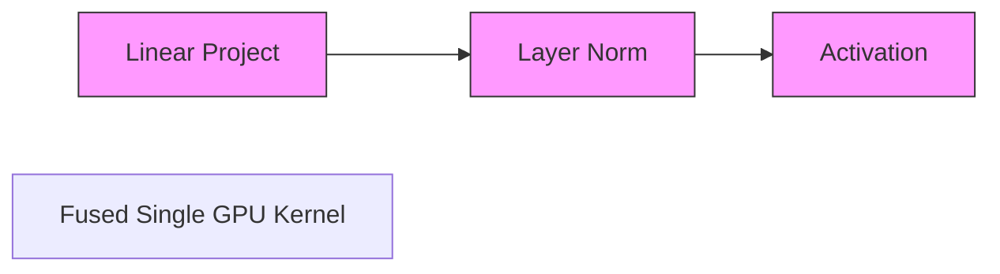

# DeepSpeed-Inference (Fused Compression Serving)

Handwritten CUDA kernels fusing linear layer operators for fast inference.

## Mermaid Diagram

## Detailed Description
- **Kernel Fusion:** Fuses multiple operations to minimize memory roundtrips to HBM.
- **Quantization Serving:** Integrates low-bit quantization kernels to double serving speeds.

[Back to main README](../README.md)
