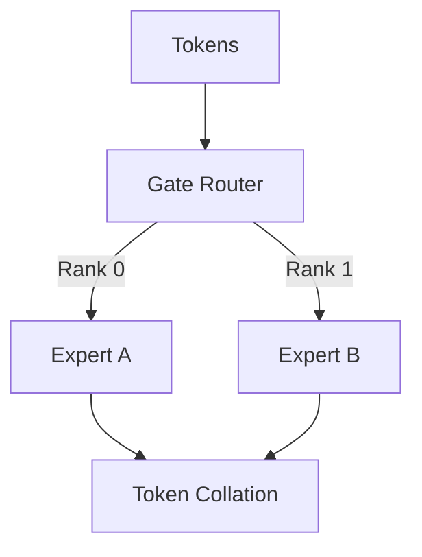

# DeepSpeed-MoE (Sparse Expert Orchestration)

Coordinating distributed expert routing and memory optimization.

## Mermaid Diagram

## Detailed Description
- **Sparse MoE Routing:** Routes specific tokens to matching experts.
- **All-to-All collectives:** Optimizes latency-sensitive collective communication boundaries across MoE groups.

[Back to main README](../README.md)
