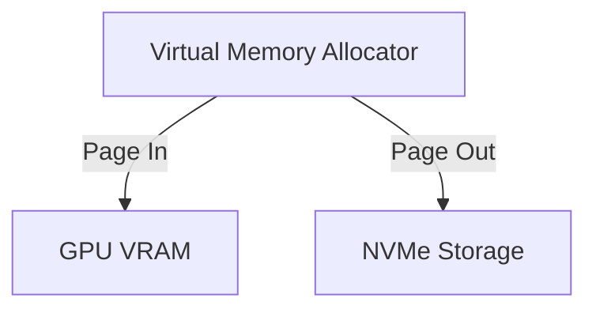

# Dynamic NVMe/CPU Memory Page Paging

Virtual memory page scheduling to stream parameters.

## Mermaid Diagram

## Detailed Description
- **Page Fault Handling:** Automatically triggers asynchronous page transfers ahead of layer execution.
- **Block Prefetching:** Schedules bulk transfers to saturate high-speed NVMe PCIe bandwidth.

[Back to main README](../README.md)
