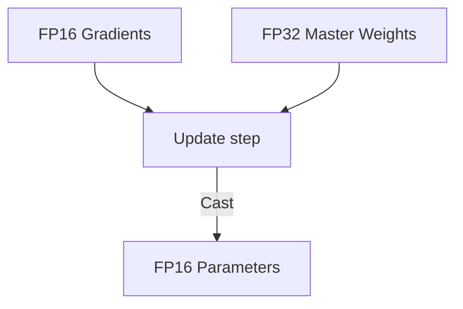

# The FP16 Precision Master Weight Underflow Hazard

Maintaining numerical precision during mixed-precision training.

## Mermaid Diagram

## Detailed Description
- **FP32 Master Weights:** Updates model states using 32-bit float storage to avoid numerical decay.
- **Loss Scaling:** Dynamically scales loss values to protect small gradient calculations.

[Back to main README](../README.md)
