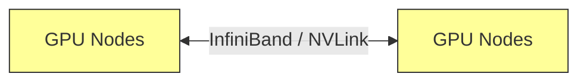

# The Interconnect All-to-All Network Bandwidth Wall

Mitigating communication constraints in distributed MoE & ZeRO-3.

## Mermaid Diagram

## Detailed Description
- **Gradient Bucket Accumulation:** Groups small updates to maximize communication packet size.
- **Overlapping Collectives:** Interleaves compute with communication.

[Back to main README](../README.md)
