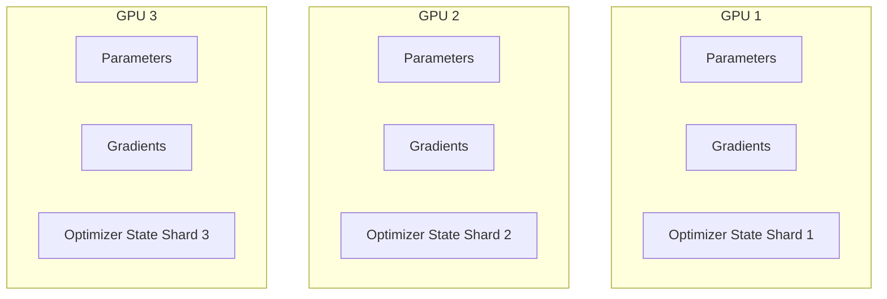

# Optimizer & Gradient Sharding (ZeRO-Stage 1 & 2)

ZeRO-Stage 1 and Stage 2 address the memory bottlenecks of large-scale distributed training by sharding optimizer states and gradients across data-parallel processes instead of replicating them.

## Mermaid Diagram

## Detailed Description
- **ZeRO-Stage 1:** Shards only the optimizer states (e.g., FP32 Adam master weights, momentum, and variance vectors) across data-parallel ranks. This reduces optimizer memory consumption by $4\times$.
- **ZeRO-Stage 2:** Shards both the optimizer states and gradients. As gradients are calculated, they are reduced and sharded, allowing each GPU to store only the gradients corresponding to its optimizer state shard.

[Back to main README](../README.md)
