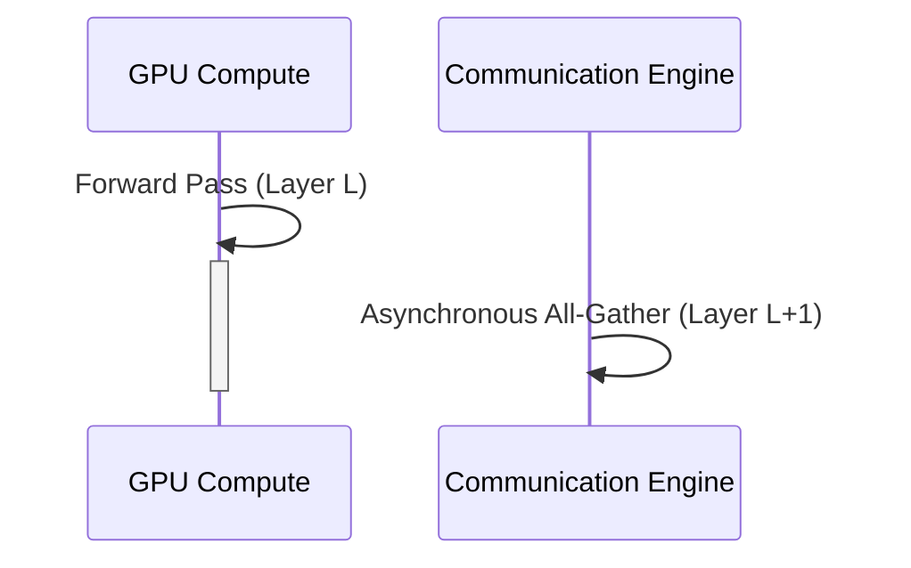

# Overlap Communication Kernels

Asynchronous communication schedulers overlapping transfers and math.

## Mermaid Diagram

## Detailed Description
- **Asynchronous Execution:** Launches communication streams in parallel with CUDA compute kernels.
- **Double Buffering:** Allocates temporary buffers to hold incoming weights before swapping them in.

[Back to main README](../README.md)
