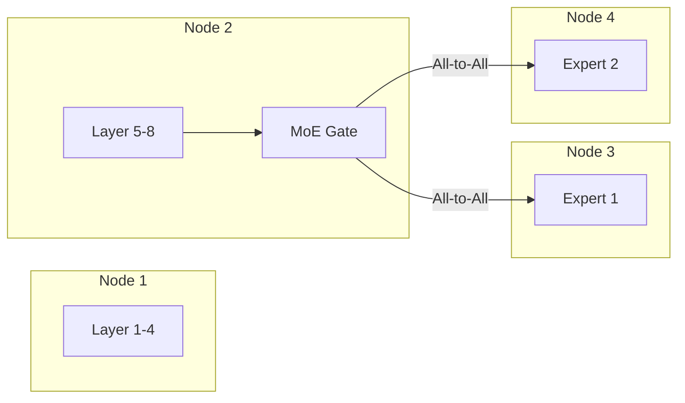

# Pipeline Parallelism & Sparse Routing (DeepSpeed-MoE & PP)

Combining pipeline partition and expert-based sparse computation.

## Mermaid Diagram

## Detailed Description
- **Pipeline Parallelism (PP):** Parts the model layers sequentially across nodes, using 1D pipeline paths.
- **DeepSpeed-MoE:** Leverages Mixture-of-Experts (MoE) routing, replacing standard feedforward layers with sparse expert kernels that activate subset routing pathways depending on tokens.

[Back to main README](../README.md)
