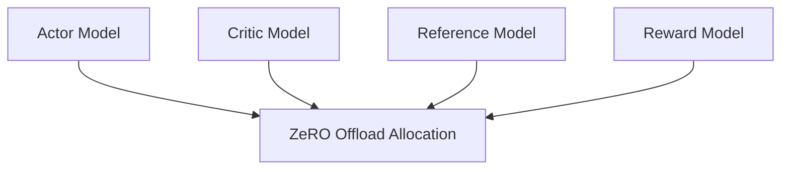

# High-Volume Post-Training Alignment Sprints (RLHF / PPO)

Orchestrating multi-network reinforcement learning frameworks.

## Mermaid Diagram

## Detailed Description
- **Co-location Optimization:** Co-locates four large neural networks in heterogeneous memory.
- **Hybrid Inference-Training:** Leverages Fast Inference engines for generation steps during PPO.

[Back to main README](../README.md)
