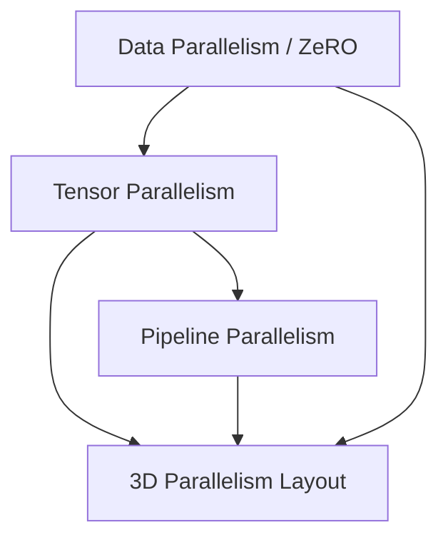

# Pre-Training Web-Scale Foundational LLMs (Megatron-DeepSpeed)

3D Parallelism orchestration for massive LLM training.

## Mermaid Diagram

## Detailed Description
- **3D Parallelism:** Combines TP, PP, and ZeRO-DP to scale model capacity to trillions of parameters.
- **Megatron Integration:** Enhances pipeline efficiency by interleaving model parts with optimized communications.

[Back to main README](../README.md)
