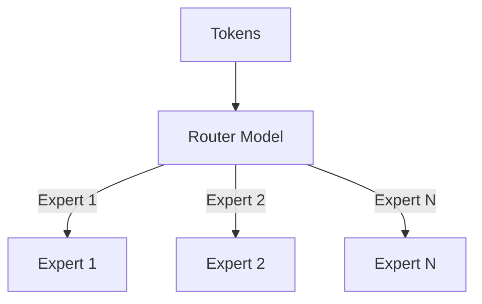

# Sparsely Routed Mixture-of-Experts Scaling

Scale-up strategies for routing sparse networks.

## Mermaid Diagram

## Detailed Description
- **Load Balancing:** Enforces routing limits to prevent hot-spot experts from stalling nodes.
- **All-to-All Optimization:** Minimizes communication paths across distributed expert ranks.

[Back to main README](../README.md)
