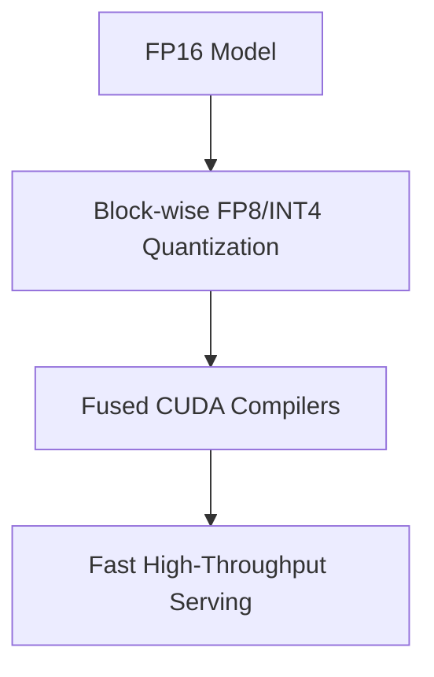

# Unified Low-Precision Omni-Inference Era

Modern techniques for multi-user high-throughput serving.

## Mermaid Diagram

## Detailed Description
- **Block-wise Quantization:** Uses dynamic quantization scales (FP8/INT4) for tensors to reduce memory.
- **Fused Operators:** Custom compiler merges memory-bound functions like Grouped-Query Attention (GQA) and activation layers to optimize inference pipeline throughput.

[Back to main README](../README.md)
