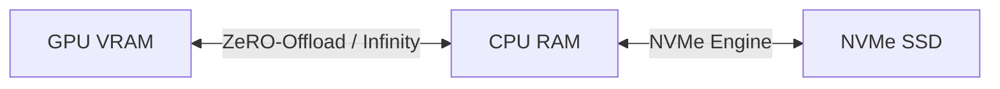

# ZeRO-Offload / ZeRO-Infinity (Heterogeneous Storage Swapping)

Exploits CPU and NVMe memory hierarchies for extreme scale training.

## Mermaid Diagram

## Detailed Description
- **Memory Tiering:** Tracks parameter memory access patterns to prefetch weights from CPU RAM or NVMe arrays.
- **Infinity Engine:** Introduces parallel data transfers over NVMe and CPU boundaries to keep GPU computing units busy.

[Back to main README](../README.md)
