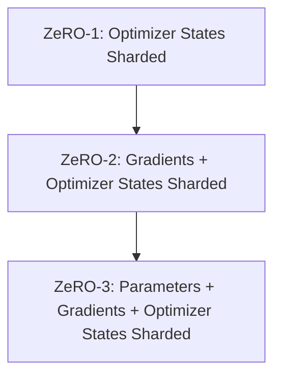

# ZeRO-Sharding Spectrum (Stages 1, 2, 3)

Deep-dive comparison and implementation details of ZeRO sharding stages.

## Mermaid Diagram

## Detailed Description
- **Stage 1:** Memory reduction factor $4\times$, communication volume identical to standard DDP.
- **Stage 2:** Memory reduction factor $8\times$, communication volume identical to standard DDP.
- **Stage 3:** Memory reduction factor scales linearly with data-parallel ranks, communication volume increases by $1.5\times$.

[Back to main README](../README.md)
